# IntegrateWise OS — Complete Layered Architecture

Workspace-First Cognitive Operating System with Governed Agents and Self-Correcting Memory

## System Orientation

IntegrateWise OS is a Workspace-First Agentic Operating System that unifies:
- operational truth + signals
- knowledge context + documents
- AI session memory (reasoning history)
- governed execution (approvals + policy)
- correction-driven learning (rewrite + reweight)

It is organized as bounded flows and bounded layers.
Everything converges through evidence — but nothing collapses into a single blob.

## Core Flows
- **Flow A — Truth & Signals Plane** (structured operational truth)
- **Flow B — Knowledge & Documents Plane** (unstructured → retrievable context)
- **Flow C — AI Session Memory Plane** (reasoning → memory objects)

## Core Cognitive Layers
- **MCP Connector** — structured AI ↔ OS write bridge (governed)
- **Think Layer** — insight + proposal generation (read-only)
- **Act Layer** — governed execution engine (write path)
- **Adjust Layer** — correction + learning loop
- **Governance Layer** — identity, permissions, policy, audit, vault
- **Workspace Layer (L1)** — user operating surface (work-first)

---

## Technology Stack (Cloudflare-Native)

### Frontend
- Next.js (App Router)
- React
- TypeScript
- Tailwind CSS
- Radix UI (headless components) + Lucide icons
- SWR for client fetch + cache patterns
- Command UI (⌘K) + multi-workspace navigation

### Cloudflare Compute & Orchestration
- Cloudflare Workers (service plane)
- Durable Objects (realtime/stateful coordination)
- Cloudflare Queues (async pipelines)
- Cloudflare Workflows (durable long-running orchestration)

### Storage Plane (Cloudflare-first)
- D1 — transactional app data, settings, metadata, audit indices
- R2 — raw files, artifacts, extracted representations
- Vectorize — embeddings + semantic retrieval index
- KV — configuration, feature flags, caching, small lookups

### Canonical Truth Store (Spine)
- Postgres (Neon) — canonical SSOT entities + relations + history
  (Used as the authoritative “Truth layer” store for Spine.)

### AI Inference (policy-driven)
- Workers AI for edge inference
- Optional external orchestration endpoints when needed (model-router pattern)
  (Used only through governed services; never bypassing policy/audit.)

**Important correction:** IntegrateWise OS is Cloudflare-native. Any legacy references to Supabase are treated as non-canonical/legacy and must not be part of the current architecture description.

---

## Layer 1 — Workspace OS Layer (User Operating Surface)

### Purpose
The primary working environment. Not AI-first. Work-first.

### Responsibilities
- Daily work surfaces: tasks, meetings, docs, projects, accounts, pipeline, risks
- Entity workspaces (Account/Project/Deal/Ticket/Person)
- Action center + approvals
- Execution logs + status
- Intelligence surfaces woven into work UI (without turning the UI into “a chatbot”)

### Data Sources (Read)
The workspace reads through the unified read plane:
- Spine (Flow A) — truth entities/relations/timelines
- Knowledge (Flow B) — documents + retrieved context
- Memory (Flow C) — summaries + decisions + user preferences
- Signals/Think outputs — situations, anomalies, risk flags
- Audit/Evidence — provenance and lineage

### Writes (User-driven only)
Users can write:
- entity edits (through governed mutation services)
- approvals / rejections
- corrections / overrides
- annotations / confirmations

The workspace never writes directly to Knowledge or Memory.
All writes are routed through the correct service boundary for governance + audit.

### Cognitive UI Surfaces (inside L1)
- **IQ Hub** — converged system status + intelligence stream
- **Evidence Drawer** — “Reasoning lineage” for any insight/proposal/action
- **Signal Strip** — real-time event ticker from connected tools
- **⌘K Command Palette** — global search across Truth + Context + Knowledge

---

## Flow A — Truth & Signal Plane (Operational SSOT)

### Purpose
Normalize real-world operational activity into canonical structured truth.

### A1 — Edge Gateway (Ingress)
Responsibilities:
- webhook ingestion
- signature verification
- tenant resolution
- idempotency enforcement
- rate limiting + abuse protection

Input: CRM, support, billing, product analytics, calendar, comms streams.

Output: A normalized Event Envelope with tenant + scope + provenance fields.

### A2 — Normalizer Service
Responsibilities:
- schema mapping → canonical model
- enum harmonization
- status normalization
- identity linking (accounts/contacts/users)
- time/currency normalization
- dedupe + DLQ handling

Output: Canonical mutation events (validated, deduped, evidence-linked).

### A3 — Spine (Canonical Truth Store)
Responsibilities:
- SSOT entities + relations
- state history + timelines
- relationship graph
- signal logs (raw + normalized)

Write Rules — only written by:
- Normalizer service
- Act layer (governed execution only)

Every write must include:
- origin_context_id
- actor_id + actor_type (human/agent)
- evidence pointers when applicable

### A4 — Signal Layer
Derived signals:
- anomalies
- threshold breaches
- lifecycle transitions
- churn/expansion markers
- risk flags

Feeds the Think layer. Never directly executes actions.

---

## Flow B — Knowledge & Context Plane (Unstructured → Retrievable Context)

### Purpose
Turn unstructured artifacts into searchable, evidence-grounded context.

### B1 — Document Ingestion
Sources:
- PDFs, docs, contracts, notes
- email exports
- meeting transcripts
- uploads via workspace
- synced connectors

### B2 — Processing Pipeline
Responsibilities:
- parsing + extraction
- chunking
- embedding
- structure detection
- metadata + entity linking

Stores:
- raw in R2
- metadata in D1
- vectors in Vectorize

### B3 — Hierarchical Chunking (Anti-fragmentation)
Each chunk stores:
- chunk text
- local summary
- section summary
- document summary
- parent/child linkage
- anchors to original document offsets

This prevents “RAG drift” and improves provenance.

### B4 — Knowledge Bank
Responsibilities:
- semantic retrieval
- evidence bundling
- topic organization
- entity linking

Read by:
- Think Layer (context builder)
- Evidence Drawer (provenance + lineage)

Rule: Knowledge Bank does not mutate Spine. It is context, not truth.

---

## Flow C — AI Session Memory Plane (Reasoning as Durable Memory)

### Purpose
Persist human + AI reasoning as structured, queryable memory inside Spaces.

### C0 — Spaces (where memory lives)
Memory is always written into a Space:
- Personal Space
- Team Space
- Account Space
- Project Space
- Topic/Subtopic Space

All sessions have:
- tenant/workspace/user identity
- scope references (account_id/project_id/etc.)
- topic/subtopic
- time range
- evidence links

### C1 — MCP Connector (Ingress for AI writes)
Responsibilities:
- receive AI tool writes
- schema validate
- identity bind (no anonymous writes)
- capability check (RBAC + policy)
- write session summaries + memory objects
- create origin_context_id and evidence pointers

Rejects:
- unauthenticated/anonymous writes
- out-of-scope writes
- privileged mutation attempts

### C2 — Session Summary Layer (Immutable)
The atomic reasoning unit per session:
- decisions
- insights
- risks
- proposals
- evidence refs
- references to Spine entities and documents
- summary embeddings for retrieval

Append-only (never rewritten).

### C3 — Memory Objects (Structured artifacts)
Granular artifacts:
- preferences
- decisions
- commitments
- assumptions
- strategies
- “what we learned”

Lifecycle:
- active → superseded → archived

These objects are queryable and reused in future contexts.

---

## MCP — AI ↔ OS Actuation Bridge (Controlled Write Path)

### Purpose
Provide a controlled structured write path from AI systems into IntegrateWise OS.

Allowed Writes:
- session summaries
- memory objects
- annotations
- proposals
- follow-up tasks (policy gated)

Never Allowed:
- direct Spine mutation (without Act + governance)
- deletes
- permission changes
- financial mutations
- policy modifications

### Identity Binding (Mandatory)
Every write includes identity + scope fields for:
- permission checks
- audit narrative
- impersonation enforcement
- model attribution/scoring

---

## Think Layer — Insight & Proposal Engine (Read-only cognition)

### Purpose
Converge Flow A + B + C into a Decision Context and produce proposals.

Inputs:
- Truth signals (Flow A)
- Knowledge context (Flow B)
- Memory + summaries (Flow C)

### Context Builder (Decision Context Object)
Builds a structured context bundle:
- entity focus
- timeline + recent deltas
- evidence bundle (documents/chunks/tool events)
- memory stack (prior decisions/preferences)
- anomaly markers + risk flags
- summary layers (daily/topic/domain)

### Cognitive Twin (Compute constraints)
Responsibilities:
- interpret and correlate signals
- detect risk/opportunity
- generate insights
- propose actions
- explain reasoning with evidence

Constraint: Think is read-only. It cannot execute or mutate.

---

## Act Layer — Governed Execution Engine (Write path)

### Purpose
Execute approved actions safely with policy + audit enforcement.

### Act Agent (Executor)
Executes:
- tool calls via connectors
- workflow triggers
- communications
- controlled updates via service endpoints

### Act Bridge (Safety wrapper)
Responsibilities:
- translate proposal → tool payload
- permission check (RBAC)
- impersonation check
- guardrail enforcement
- execution logging
- immutable audit linking

**Power Rule (Non-negotiable):** Agent power ≤ initiating user power — always enforced.

### Execution Modes
- Manual (human-run)
- Assisted (AI proposes, human approves)
- Autonomous (policy gated, auditable, reversible)

Every execution produces:
- execution record
- audit narrative
- evidence bundle pointer
- outcome written back to Truth/Context

---

## Adjust Layer — Correction & Learning Loop (Self-healing)

### Purpose
Convert user overrides into learning signals and system improvements.

### Correction Events
Captured when:
- insight rejected
- proposal rejected
- execution reversed
- user overrides agent edits
- evidence deemed insufficient

### Effects (What changes)
Adjusts:
- proposal ranking
- retrieval weighting
- autonomy eligibility
- topic rewrite priority
- agent confidence calibration
- signal thresholds (policy controlled)

These changes trigger:
- re-indexing
- memory consolidation
- summary rewrites (versioned)

---

## Summary Aggregation Layer (Memory compaction + durable knowledge)

Layers:
- Session summary — immutable
- Daily summary — rebuildable
- Topic summary — versioned rewrite
- Domain summary — supersession-only rewrite

Rewrite Rules:
- Session: never rewrite
- Daily: rebuild allowed
- Topic: versioned rewrite
- Domain: supersession only

This prevents memory drift and supports governance/audit.

---

## Governance Layer — Identity, Guardrails, Vault, Audit

### Vault
- tenant-scoped secrets
- agent-scoped access
- rotation support
- connector credential isolation

### Guardrails
Policy checks:
- monetary
- scope
- frequency
- compliance + risk rules
- approvals required conditions

### Adapter Boundary
- Server adapters (elevated, audited)
- Client adapters (restricted, masked)

### RBAC + Field/Row Masks
Enforced across:
- views
- evidence access
- retrieval context
- action execution

---

## End-to-End System Flow (Canonical)

External Signals → Flow A → Spine
Documents → Flow B → Knowledge Bank
AI Sessions → MCP → Flow C (Spaces + Memory)

A + B + C → Think → Proposals
Proposals → Governance → Act Bridge
Act → Execution → Audit + Evidence
Execution → updates Truth + Context
User overrides → Adjust → rewrite/reweight → system improves

---

## Final System Properties (What IntegrateWise guarantees)

IntegrateWise OS is:
- workspace-first
- context-rich
- AI-augmented
- audit-safe
- permission-safe
- rewrite-capable
- self-correcting

**No ghost actions.**
**No reasoning drift.**
**No silent AI writes.**

This is the IntegrateWise OS people refer to: a Cognitive Operating System that stays grounded in truth and improves through governed learning.

---

## Canonical Architecture Flowchart

```mermaid
flowchart TD

%% =========================================================
%% IntegrateWise OS — L0 + L1 Progressive Hydration + L2 + L3
%% Cloudflare-native ONLY. (No Supabase. No Neon.)
%% L1 stays pure. L2 is sellable overlay.
%% =========================================================

%% -------------------------
%% GLOBAL: Context Envelope + Policy
%% -------------------------
CTX["CTX Envelope<br/>tenant_id, workspace_id, user_id<br/>role/scope, host_app, object_scope<br/>topic/subtopic, time_range"]
RBAC["RBAC + Field/Row Masks<br/>policy scopes"]
VIEWREG["View Registry<br/>view_id -> modules + defaults<br/>module hydration requirements"]
BAGREG["Feature Bag Registry<br/>available modules + gating rules<br/>plan + role + hydration level"]

CTX --> RBAC
CTX --> VIEWREG
CTX --> BAGREG

%% =========================================================
%% L0: Onboarding (Progressive)
%% =========================================================
subgraph L0["L0: Onboarding & Progressive Enablement (Cloudflare)"]
L0A["L0.1 Auth + Tenant Bootstrap<br/>Cloudflare Access / OIDC / JWT<br/>Turnstile + session issuance<br/>create tenant/workspace/user"]
L0B["L0.2 Context Capture<br/>role, department, goals<br/>initial topics + scope"]
L0C["L0.3 Minimal Data Seed<br/>manual forms + CSV + copy/paste<br/>(no tools required)"]
L0D["L0.4 Connector Add (Optional)<br/>OAuth/API keys/Webhooks<br/>progressive integrations"]
L0E["L0.5 Hydration Scorer<br/>computes hydration level per bucket<br/>updates Feature Bag entitlements"]
L0F["L0.6 First Projection Build<br/>creates initial L1 snapshots<br/>based on available buckets"]
end

%% =========================================================
%% L1: Pure Workspace View (Progressive Hydration + Feature Bag)
%% =========================================================
subgraph L1["L1: Workspace (Pure) — Progressive Hydration + Feature Bag (No Cognitive UI)"]
L1NAV["L1 Shell/Nav<br/>Home fixed + user drag/drop layout<br/>module slots"]
L1Q["L1 Query<br/>GET /view/{view_id}<br/>snapshot from unified read layer"]
L1UI["L1 Modules Render<br/>Home/Projects/Accounts/...<br/>ONLY from Spine+Context+Knowledge"]
L1DELTA["L1 Deltas<br/>SSE/WebSocket view updates<br/>(optional now, later real-time)"]
BAG["Feature Bag (User)<br/>enabled modules list<br/>drag/drop add/remove<br/>gated by hydration + plan"]
end

L1NAV --> BAG
BAG --> L1UI
L1Q --> L1UI
L1DELTA --> L1UI

%% =========================================================
%% PROGRESSIVE HYDRATION BUCKETS (What enables what)
%% =========================================================
subgraph BUCKETS["Progressive Hydration Buckets (Enable L1 modules safely)"]
B0["Bucket 0: Identity + Workspace<br/>tenant/user/roles<br/>basic nav + preferences"]
B1["Bucket 1: Manual Core Objects<br/>Projects, Tasks, Notes, Docs metadata<br/>Accounts minimal (manual)"]
B2["Bucket 2: Document Context<br/>uploads to R2 + metadata in D1<br/>Context facts extracted (light)"]
B3["Bucket 3: Knowledge Index<br/>chunking + embeddings (Vectorize)<br/>topics + retrieval working"]
B4["Bucket 4: External Tool Sync<br/>CRM/Support/Calendar/Slack<br/>entities + relations stronger"]
B5["Bucket 5: Health Metrics Packs<br/>account health scaffolds<br/>basic computed metrics (no Think)"]
B6["Bucket 6: Governance Readiness<br/>approvals config + audit trails<br/>action gating available"]
B7["Bucket 7: Automation Readiness<br/>workflows + agents allowed<br/>Think/Act phased later"]
end

L0A --> B0
L0C --> B1
L0C --> B2
L0D --> B4
B2 --> B3
B4 --> B5
B5 --> B6
B6 --> B7

B0 --> L0E
B1 --> L0E
B2 --> L0E
B3 --> L0E
B4 --> L0E
B5 --> L0E
B6 --> L0E
B7 --> L0E

%% =========================================================
%% FEATURE BAG CONTENT (Modules unlocked progressively)
%% =========================================================
subgraph MODS["Feature Bag — Drop-in Modules (L1)"]
MHOME["Home (Fixed)<br/>Today summary + shortcuts"]
MPROJ["Projects"]
MACCT["Accounts"]
MCONT["Contacts"]
MMEET["Meetings"]
MDOCS["Docs"]
MTASK["Tasks"]
MCAL["Calendar"]
MNOTE["Notes"]
MKSP["Knowledge Space (L1 view)<br/>search + browse only"]
MTEAM["Team"]
MPIPE["Pipeline"]
MRISK["Risks"]
MEXP["Expansion"]
MANL["Analytics"]
end

%% gating examples
B1 --> MPROJ
B1 --> MTASK
B1 --> MNOTE
B2 --> MDOCS
B3 --> MKSP
B4 --> MACCT
B4 --> MCONT
B4 --> MMEET
B4 --> MCAL
B5 --> MRISK
B5 --> MANL
B4 --> MPIPE
B4 --> MTEAM
B5 --> MEXP

%% =========================================================
%% L2: Intelligence Layer (Sellable Overlay UI)
%% =========================================================
subgraph L2["L2: Intelligence Layer (Complete Overlay UI) — The Product Interface"]
L2HOST["Host Adapter<br/>IntegrateWise UI OR Salesforce/Zendesk/etc<br/>gets object context"]
L2SHELL["L2 Overlay Shell<br/>Side Drawer / Fullscreen<br/>tabs + routing inside overlay"]

%% L2 includes "UIs" for the same foundations
L2SPINEUI["Spine UI (Truth)<br/>entities + relations + timelines"]
L2CTXUI["Context UI<br/>docs + extracted facts + threads"]
L2KNOWUI["Knowledge UI<br/>topics + retrieval + summaries"]

%% Intelligence & control surfaces
L2SIG["Signals & Situations UI<br/>health/churn/risks/alerts"]
L2EVD["Evidence + Audit UI<br/>provenance, diffs, refs"]
L2AG["Agents UI<br/>run agents, prompts, outputs"]
L2WF["Workflows UI<br/>approval flows + automation runs"]
L2GOV["Governance UI<br/>policies, scopes, masks, approvals"]
L2CFG["Config Center<br/>connectors, packs, rules, mappings<br/>RBAC, topics, view registry"]
L2MEM["Memory UI<br/>session summaries + consolidated memory<br/>topic/subtopic/user lens"]
end

L2HOST --> L2SHELL
L2SHELL --> L2SPINEUI
L2SHELL --> L2CTXUI
L2SHELL --> L2KNOWUI
L2SHELL --> L2SIG
L2SHELL --> L2EVD
L2SHELL --> L2AG
L2SHELL --> L2WF
L2SHELL --> L2GOV
L2SHELL --> L2CFG
L2SHELL --> L2MEM

%% L2 must NOT pollute L1
L2SHELL -. "separate surface (no L1 coupling)" .-> L1NAV

%% =========================================================
%% L3: Cloudflare Backend Wiring (Workers + Storage)
%% =========================================================
subgraph L3["L3: Cloudflare Backend (Workers + D1 + R2 + Vectorize + KV + Queues + Workflows)"]
AUTH["auth (Worker)<br/>Access/OIDC verify + JWT issue<br/>Turnstile + sessions"]
TEN["tenants (Worker + D1)<br/>tenant resolution + scopes"]
SPINE["spine (Worker + D1)<br/>SSOT entities + relations + history"]
STORE["store (Worker + D1 + R2)<br/>file CRUD + pointers"]
LOADER["loader (Worker + Queues)<br/>ingest orchestration"]
NORM["normalizer (Worker + D1)<br/>schema validate + dedupe + dlq"]
KNOW["knowledge (Worker + Vectorize + R2)<br/>chunk + embed + retrieve"]
IQ["iq-hub (Worker + D1)<br/>session summaries + memory stack"]
CONS["Memory Consolidator<br/>(Workflows/Agents)<br/>topic/subtopic/user aggregation<br/>writes consolidated artifacts"]
GOV["govern (Worker + D1/KV)<br/>policies + approvals + audit"]
WF["workflow (Workflows)<br/>durable approvals + runs"]
AGS["agents (Workflows)<br/>agent colony execution"]
THINK["think (Worker + Queue)<br/>signals engine (phased)"]
ACT["act (Worker)<br/>execute actions (phased)"]
EVID["evidence/audit store (D1 + R2)<br/>immutable refs + provenance"]
VIEWS["View/Projection API (Worker)<br/>hydrated snapshots for L1<br/>built from Spine+Context+Knowledge"]
STREAM["Stream Gateway (SSE/WS)<br/>view deltas + notifications"]
end

%% ---------------------------------------------------------
%% Wiring: L0 -> L3
%% ---------------------------------------------------------
L0A --> AUTH
L0A --> TEN
L0B --> TEN
L0C --> SPINE
L0C --> STORE
L0D --> LOADER

STORE --> LOADER
LOADER --> NORM
NORM --> SPINE
NORM --> KNOW
NORM --> EVID
IQ --> EVID

%% Consolidation loop (memory -> retrieval boost)
IQ --> CONS
CONS --> IQ
CONS --> KNOW
CONS --> EVID

%% ---------------------------------------------------------
%% Wiring: L1 -> Unified Read Layer (Spine + Context + Knowledge)
%% ---------------------------------------------------------
L1Q --> VIEWS
VIEWS --> SPINE
VIEWS --> STORE
VIEWS --> KNOW
VIEWS --> IQ
VIEWS --> EVID
VIEWS --> L1Q

%% Optional deltas
VIEWS --> STREAM
STREAM --> L1DELTA

%% ---------------------------------------------------------
%% Wiring: L2 -> Complete Intelligence Plane
%% ---------------------------------------------------------
L2SPINEUI --> SPINE
L2CTXUI --> STORE
L2KNOWUI --> KNOW
L2MEM --> IQ
L2MEM --> CONS
L2EVD --> EVID
L2GOV --> GOV
L2WF --> WF
L2AG --> AGS
L2SIG --> THINK
L2CFG --> TEN
L2CFG --> GOV
L2CFG --> VIEWS

%% Action path (phased)
L2AG -. "proposals" .-> WF
WF --> GOV
GOV --> ACT
ACT --> EVID
ACT --> SPINE

%% ---------------------------------------------------------
%% Progressive enablement of L1 modules via Bag Registry
%% ---------------------------------------------------------
L0E --> BAGREG
BAGREG --> BAG
VIEWREG --> VIEWS
RBAC --> VIEWS
RBAC --> STREAM
CTX --> VIEWS
CTX --> STREAM
```

