```mermaid
flowchart TD

%% =========================================================
%% INTEGRATEWISE OS — FINAL MASTER (L0–L1–L2–L3)
%% + 8-STAGE PIPELINE + EXTRACTION/NORMALIZATION ACCELERATORS
%% + DOMAIN ACCELERATORS (incl MRR/Revenue) + MCP/AI Chats
%% =========================================================

%% =========================
%% SECTION 0 — CONTEXT SWITCH (APPLIES EVERYWHERE)
%% =========================
CTX["Context Switch (enum + scope)\ncontext: personal|business|csm|tam|sales|marketing|ops|pm|generic-team\nscope: org_id, team_id, owner_id, account_id, region\npolicy: RBAC + field/row gates + tool access gates"]

%% =========================
%% SECTION 1 — L0: ONBOARDING (SERVICE-BACKED)
%% =========================
subgraph L0["L0: Onboarding & First Hydration (uses L3)"]
  L0_Signup["L0.1 Signup/Login\n(identity + tenant bootstrap)"]
  L0_ContextQ["L0.2 Context Questions\n(select context + capture scope)"]
  L0_ToolPick["L0.3 Connect 1–2 Tools OR Data Dump\n(OAuth/API key/CSV/JSON/PDF/email export)"]
  L0_Hydrate["L0.4 First Hydration\n(initial anchors + first summaries)"]
end

%% =========================
%% SECTION 2 — L1: CONTEXT-AWARE WORKSPACE (VIEW)
%% =========================
subgraph L1["L1: Context-Aware Workspace (UI Shell; projections differ by CTX)"]
  L1_Home["1) Home\nDashboard | Exec Dashboard | Team Dashboard"]
  L1_Projects["2) Projects\nProjects | Initiatives | Roadmap"]
  L1_Accounts["3) Accounts\nAccounts | Account 360 | Portfolio"]
  L1_Contacts["4) Contacts\nContacts | Org Chart | Stakeholders"]
  L1_Meetings["5) Meetings\nMeetings | QBR/Cadence | Incidents"]
  L1_Docs["6) Docs\nDocs | Contracts | PRDs | Evidence"]
  L1_Tasks["7) Tasks\nTasks | Playbooks | Action Items"]
  L1_Calendar["8) Calendar\nCalendar | Renewals | Launches"]
  L1_Notes["9) Notes\nNotes | Meeting Notes | Engineering Notes"]
  L1_Knowledge["10) Knowledge Space\nKB/Wiki | Topic Spaces | Stored Content"]
  L1_Team["11) Team\nDirectory | Coverage | Org Health"]
  L1_Pipeline["12) Pipeline\nDeals | Forecast | Renewals"]
  L1_Risks["13) Risks\nRisks | Escalations | Tech Debt"]
  L1_Expansion["14) Expansion\nGrowth | Adoption | Initiatives"]
  L1_Analytics["15) Analytics Widgets\n(configured per CTX)"]
end

%% =========================
%% SECTION 3 — L2: UNIVERSAL COGNITIVE (BOTTOM-TO-TOP SLIDE-UP)
%% =========================
subgraph L2["L2: Universal Cognitive Layer (same UX for all; data varies via CTX)"]
  L2_SpineUI["L2.1 Spine UI\n(SSOT projection by context/scope)"]
  L2_ContextUI["L2.2 Context UI\n(unstructured + extracted facts)"]
  L2_KnowledgeUI["L2.3 Knowledge UI\n(chunks + retrieval + summaries)"]
  L2_Evidence["L2.4 Evidence Drawer\n(provenance + timeline + evidence_refs)"]
  L2_Signals["L2.5 Signals/Situations\n(materialized outputs)"]
  L2_Think["L2.6 Think\n(scoring + reasoning + context graph)"]
  L2_Act["L2.7 Act\n(agent proposals + executions)"]
  L2_HITL["L2.8 Human-in-loop\n(approve/reject/redo)"]
  L2_Govern["L2.9 Govern\n(policy + RBAC + write rules)"]
  L2_Adjust["L2.10 Adjust\n(corrections + self-heal)"]
  L2_Repeat["L2.11 Repeat\n(feedback loops)"]
  L2_AuditUI["L2.12 Audit Trail UI\n(immutable logs + exports)"]
  L2_AgentCfg["L2.13 Agent Config\n(registry + tools + limits)"]
  L2_Twin["L2.14 Digital Twin\n(memory + proactive context)"]
end

%% =========================
%% SECTION 4 — L3: UNIVERSAL BACKEND (CLOUDFLARE)
%% =========================
subgraph L3["L3: Universal Backend (Cloudflare Workers + DO + R2 + D1)"]
  APIGW["API Gateway / BFF\n(enforces CTX + policy gates + routing)"]

  %% Core
  AUTH["/auth/*\nlogin, oauth, rbac"]
  USER["/user/*\nprofile, org/team, permissions"]
  ONBOARD["/onboard/*\ncontext capture + onboarding state"]

  %% Connectivity & ingestion
  CONN["/connectors/*\nconnector catalog + auth + creds refs"]
  INGEST["/ingest/*\nupload/dump/webhook intake"]
  SYNC["/sync/*\npoll/delta schedule + webhook handlers"]
  ORCH["/orchestrator/*\njobs + retries + routing"]
  BUS["Event Bus\n(streaming + async triggers)"]

  %% Stores
  SPINE["Spine DB (SSOT)\nentities + relations + scope"]
  CONTEXT["Context Store\nunstructured + embeddings + extracted facts"]
  FILES["Object/File Store\nraw files + versions"]
  AUDITSTORE["Audit/Evidence Store\nimmutable logs + evidence_refs"]

  %% Domain APIs (context-configurable by schema registry)
  D_Accounts["/accounts/*\naccount master + assigned roles + health anchors"]
  D_Projects["/projects/*\nprojects/initiatives/roadmaps"]
  D_Contacts["/contacts/*\nstakeholders + org charts"]
  D_Meetings["/meetings/*\nmeetings + transcripts + summary refs"]
  D_Docs["/docs/*\nfiles + versions + OCR + metadata"]
  D_Tasks["/tasks/*\ntasks + playbooks + action items"]
  D_Calendar["/calendar/*\ncalendar events + sync"]
  D_Notes["/notes/*\nnotes + linkage to entities"]
  D_Knowledge["/knowledge/*\nknowledge items + retrieval + chunk mgmt"]
  D_Team["/team/*\nteams + memberships + coverage mapping"]
  D_Pipeline["/pipeline/*\nopp/deals/forecast/renewals"]
  D_Risks["/risks/*\nrisks + escalations + registers"]
  D_Expansion["/expansion/*\ninitiatives + adoption + growth"]
  D_Analytics["/analytics/*\nmetrics + trends + aggregations"]
  D_Evidence["/evidence/*\nprovenance + evidence_refs + timelines"]
  D_Audit["/audit/*\nimmutable logs + exports"]

  %% AI / Governance APIs
  AICHAT["/ai/chats/*\nsessions + summaries + decision memory"]
  MCP["/mcp/*\nexternal AI capture"]
  INSIGHTS["/ai/insights/*\nexplain + recommend"]
  AGENT["/agent/*\npropose/run/monitor tools"]
  APPROVAL["/approval/*\nreview/approve/reject/redo"]
  GOVAPI["/governance/*\npolicies + RBAC + write rules"]
  BILL["/billing/*\nplans + usage + invoices"]
  OBS["/observability/*\nhealth + logs + metrics"]
  SEC["/security/*\ntokens + rate + idempotency"]
end

%% =========================
%% SECTION 5 — 8-STAGE PIPELINE (ALWAYS USED)
%% =========================
subgraph PIPE["L3 Pipeline: 8 Mandatory Stages (every tool, every mode)"]
  ST1["1) Analyzer\npayload framing + file type detect"]
  ST2["2) Classifier\nstructured/unstructured/AI-chat\nobject candidates + confidence"]
  ST3["3) Filter\nPII scrub + dedupe + scope gate"]
  ST4["4) Refiner\ncleanup + normalization pre-pass"]
  ST5["5) Extractor\nOCR/parse/transcribe\nfield extraction + link hints"]
  ST6["6) Validator\nschema checks + constraints"]
  ST7["7) Sanity Check\nAI+rules, anomaly/quality\nhold/reject/quarantine"]
  ST8["8) Sectorizer\npartition by tool+object+pattern\ndomain routing"]
end

%% =========================
%% SECTION 6 — ACCELERATORS (PLUMBING)
%% =========================
subgraph A_PLUMB["⚡ Plumbing Accelerators (mandatory)"]
  EA1["Extraction Accelerator\n(complete pull + preserve structure)\n- object graph\n- relationships\n- formulas\n- automations\n- external_id registry"]
  NA0["Schema Registry\n(context -> SSOT schema preset)\nfield masks + traits + required anchors"]
  NA1["Normalization Accelerator\n(tool->domain mapping)\ncanonical entities + relations + evidence_refs"]
end

%% =========================
%% SECTION 7 — DOMAIN ACCELERATORS (EXISTING 6)
%% =========================
subgraph A_DOMAIN["⚡ Domain Accelerators (compute -> signals/metrics/situations)"]
  A1["Customer Health Score\n(accelerators/index.ts)"]
  A2["Churn Prediction\n(accelerators/index.ts)"]
  A3["Revenue Forecaster\n(accelerators/index.ts)"]
  A4["Pipeline Velocity\n(accelerators/index.ts)"]
  A5["Support Health\n(accelerators/support-marketing.ts)"]
  A6["Marketing Attribution\n(accelerators/support-marketing.ts)"]
end

%% =========================
%% SECTION 8 — REVENUE/MRR ACCELERATORS (ADD-ON PACK)
%% =========================
subgraph A_MRR["⚡ Revenue (MRR) Accelerators (sellable add-ons)"]
  M1["MRR/ARR Engine\nMRR, ARR, NRR, GRR\ncohorts + movements"]
  M2["Renewal Risk Engine\nrenewal calendar + risk factors\nnext-best-action"]
  M3["Expansion Engine\nupsell/cross-sell signals\nwhite-space mapping"]
  M4["Pricing & Discount Guard\nmargin leak + approvals\npolicy-driven thresholds"]
  M5["Collections Forecast Engine\ncashflow + overdue risk\ninvoice/payment sync"]
  M6["Commission & Quota Engine\nattainment + pipeline coverage\nrep/team rollups"]
end

%% =========================
%% SECTION 9 — SYNC CADENCE (PER CONNECTOR)
%% =========================
subgraph CAD["Sync Cadence (per connector)"]
  C1["Webhooks\nnear-real-time"]
  C2["Scheduled Poll\n5m/15m/hourly"]
  C3["Batch Backfill\nnightly/weekly"]
end

%% =========================================================
%% LAYER LINKING (WHO CALLS WHO)
%% =========================================================

%% Context originates in L0 and is enforced at APIGW
L0_ContextQ --> CTX
CTX --> APIGW

%% L0 uses L3 services
L0_Signup --> APIGW --> AUTH
L0_Signup --> APIGW --> USER
L0_ContextQ --> APIGW --> ONBOARD
L0_ToolPick --> APIGW --> CONN
L0_ToolPick --> APIGW --> INGEST
L0_Hydrate --> APIGW --> ORCH

%% L1 uses L3 domain APIs
L1_Home --> APIGW
L1_Projects --> APIGW --> D_Projects
L1_Accounts --> APIGW --> D_Accounts
L1_Contacts --> APIGW --> D_Contacts
L1_Meetings --> APIGW --> D_Meetings
L1_Docs --> APIGW --> D_Docs
L1_Tasks --> APIGW --> D_Tasks
L1_Calendar --> APIGW --> D_Calendar
L1_Notes --> APIGW --> D_Notes
L1_Knowledge --> APIGW --> D_Knowledge
L1_Team --> APIGW --> D_Team
L1_Pipeline --> APIGW --> D_Pipeline
L1_Risks --> APIGW --> D_Risks
L1_Expansion --> APIGW --> D_Expansion
L1_Analytics --> APIGW --> D_Analytics

%% L2 uses L3 cognitive/governance APIs
L2_Evidence --> APIGW --> D_Evidence
L2_AuditUI --> APIGW --> D_Audit
L2_KnowledgeUI --> APIGW --> AICHAT
L2_Twin --> APIGW --> AICHAT
L2_AgentCfg --> APIGW --> AGENT
L2_HITL --> APIGW --> APPROVAL
L2_Govern --> APIGW --> GOVAPI

%% Observability/Security/Billing touchpoints
APIGW -.-> OBS
APIGW -.-> SEC
APIGW -.-> BILL
AGENT -.-> BILL
EA1 -.-> BILL
NA1 -.-> BILL
M1 -.-> BILL
M2 -.-> BILL
M3 -.-> BILL
M4 -.-> BILL
M5 -.-> BILL
M6 -.-> BILL

%% =========================================================
%% CONNECTORS + EVENTS + PIPELINE (ONBOARDING + DAILY SYNC)
%% =========================================================

%% Connector cadence -> Sync
CONN --> C1 --> SYNC
CONN --> C2 --> SYNC
CONN --> C3 --> SYNC

%% Intake routes -> orchestrator -> event bus
INGEST --> ORCH
SYNC --> ORCH
ORCH --> BUS

%% Extraction Accelerator runs first when tool supports full object graph pull
BUS --> EA1

%% Pipeline always runs (even after extraction)
EA1 --> ST1
BUS --> ST1
ST1 --> ST2 --> ST3 --> ST4 --> ST5 --> ST6 --> ST7 --> ST8

%% Normalization Accelerator builds SSOT (schema registry driven)
ST8 --> NA0 --> NA1
NA1 --> SPINE
NA1 --> CONTEXT
NA1 --> AUDITSTORE
ST1 --> FILES

%% Evidence and audit index into audit store
D_Evidence --> AUDITSTORE
D_Audit --> AUDITSTORE

%% =========================================================
%% MCP + AI CHATS
%% =========================================================
MCP --> AICHAT
AICHAT --> CONTEXT
AICHAT --> AUDITSTORE

%% =========================================================
%% ACCELERATORS (POST-NORMALIZATION COMPUTE)
%% =========================================================

%% Domain accelerators inputs
SPINE --> A1
SPINE --> A2
SPINE --> A3
SPINE --> A4
SPINE --> A5
SPINE --> A6
CONTEXT --> A1
CONTEXT --> A2
CONTEXT --> A5
CONTEXT --> A6
AUDITSTORE --> A1
AUDITSTORE --> A2
AUDITSTORE --> A5

%% MRR accelerators inputs
SPINE --> M1
SPINE --> M2
SPINE --> M3
SPINE --> M4
SPINE --> M5
SPINE --> M6
CONTEXT --> M2
CONTEXT --> M3
AUDITSTORE --> M4

%% Accelerators -> Signals -> Think -> Insights/Evidence -> Act
A1 --> L2_Signals
A2 --> L2_Signals
A3 --> L2_Signals
A4 --> L2_Signals
A5 --> L2_Signals
A6 --> L2_Signals

M1 --> L2_Signals
M2 --> L2_Signals
M3 --> L2_Signals
M4 --> L2_Signals
M5 --> L2_Signals
M6 --> L2_Signals

L2_Signals --> L2_Think
L2_Think --> INSIGHTS
L2_Think --> D_Evidence

L2_Think --> L2_Act
L2_Act --> AGENT
L2_Act --> APPROVAL
APPROVAL --> GOVAPI
GOVAPI --> AUDITSTORE
AGENT --> BUS

%% L1 drilldowns into L2
L1_Accounts --> L2_Evidence
L1_Projects --> L2_Evidence
L1_Risks --> L2_Evidence
L1_Analytics --> L2_Signals
```

# IntegrateWise OS — Master Architecture Diagram

> **Version**: Final Master (L0–L1–L2–L3)  
> **Includes**: 8-Stage Pipeline + Extraction/Normalization Accelerators + Domain Accelerators + MCP/AI Chats

---

---

## Legend

| Symbol | Meaning |
|--------|---------|
| `-->` | Direct dependency/call |
| `-.->` | Optional/monitoring dependency |
| Subgraph | Logical grouping/layer |
| `[]` | Service/API |
| `[""]` | UI Component/View |

---

## Layer Summary

| Layer | Purpose | Entry Point |
|-------|---------|-------------|
| **L0** | Onboarding & First Hydration | Signup flow |
| **L1** | Context-Aware Workspace | UI Shell |
| **L2** | Universal Cognitive Layer | Bottom slide-up |
| **L3** | Universal Backend | API Gateway |
| **Pipeline** | 8-Stage Processing | Event Bus |
| **Accelerators** | Value-Add Compute | Post-normalization |
