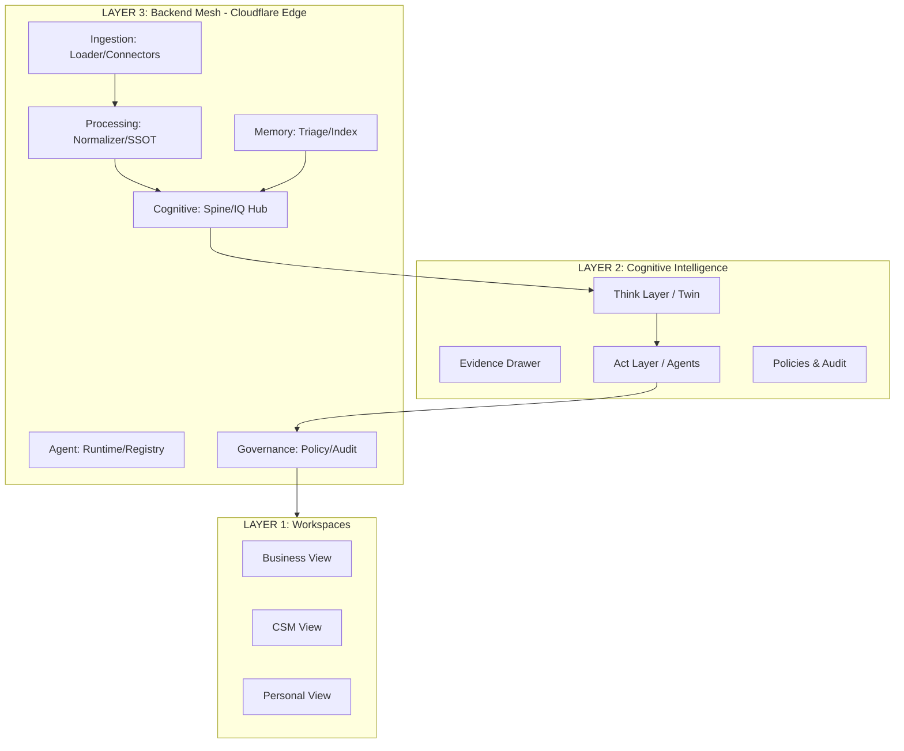

# IntegrateWise OS — Canonical Architecture (V11+)

## I. Layered Architecture Overview

### Layer 1: Daily Workspace Views

- **Business View**: Strategic Hub, Metrics, Brainstorming, Website, CRM, Marketing, Products, Services, Sales Hub, Clients, Tasks, Knowledge Hub, Data Sources, Integrations.
- **CSM View**: Ops Dashboard (Accounts, Contacts, Meetings, Tasks, Opportunities, Risks), plus 6 deep-dive layers: Commercial, Stakeholder, Technical, Strategic, Risk, Outcome.
- **Personal View**: Home, Today, Tasks, Goals & Metrics, Calendar, Knowledge Hub, Profile, Integrations, Settings.

### Layer 2: Cognitive Intelligence Layer

- **Evidence Drawer**: Spine, Context, Knowledge, Governance, Audit — always linked to artifacts and actions.
- **Think Layer (Digital Twin)**: Merges daily workspace with AI, SSOT, and context; enables AI-human collaboration and guidance.
- **Act Layer**: Agent and workflow execution with audit, approvals, and policy guardrails.
- **Policies, Correct/Redo, Agent Colony, Proactive Twin**:
  - Agents act, but every action can be paused for approval, corrected, or explained, with all steps logged.
  - Agents learn from context, AI chats, and feedback (self-healing).
  - **Workflows**: Declarative, template-driven automations with human-in-the-loop where needed.

### Layer 3: Backend Service Mesh

(Deployed on **Cloudflare Workers + Durable Objects + R2 + D1**)

- **Ingestion**: `loader-service`, `connector-runtime/adapters`, `webhook-gateway`, `delta-sync`, `credential vault bridge`.
- **Processing**: `ai-loader-service` (initial/bulk ingest), `normalizer-service` (SSOT extract), `ssot-definition-service` (schema rules).
- **Memory/Triage**: `triage-bot-service` (Cloudflare AI Workers), `mcp-layer-service` (agent control/signals), `personal-llm-world-service` (Firestore/D1), `memory-index-service`.
- **Cognitive/Insights**: `spine-db-service`, `context-store-service`, `evidence-binder-service`, `iq-hub-service` (decision-ready feed), `insight-engine-service` (signals, nudges, trends), `brainstorm-service` (collaborative planning).
- **Agent/Workflow**: `agent-registry`, `workflow-config`, `tool-action-surface`, `agent-runtime` (with audit, rollback, compensations).
- **Sync/Events**: `sync-orchestrator`, `repeat-scheduler`, `event-bus-service` (decoupled pub/sub).
- **Governance**: `policy-engine` (RBAC, scope, field-level), `tenant-provisioner`, `governance-policy`, `audit-log` (immutable, evidence-bound).
- **Platform**: `auth-session`, `notifier` (alerts, nudges), `object-store (R2, KV)`, `monitoring-observability`, `billing` (usage/paywall).

---

## II. Data Flow & Intelligence Loop

### A. The Three Core Flows

1. **Flow 1 — Structured Truth**: CRM, tasks, calendar, emails, billing — via connectors/loaders → Spine SSOT.
2. **Flow 2 — Unstructured Context**: Docs, PDFs, chats, Slack, meetings — via loader + context extraction → Knowledge Bank.
3. **Flow 3 — AI Memory**: AI session transcripts captured via MCP Connector → Firebase → Knowledge Bank. See [FLOW_3_AI_MEMORY_SPEC](../architecture/FLOW_3_AI_MEMORY_SPEC.md).

### B. Where It All Merges

- **IQ Hub**: Aggregates normalized truth (Spine), unstructured insights (Context), and historical memory (AI chats) — delivers one “cognitive feed” for Think/Act/Adjust.
- **Evidence Drawer**: Links every decision, action, or recommendation to its source data, context, and audit trail.

### C. Continuous Cognitive Loop

1. **Ingest**: Data arrives from connectors, loaders, or file uploads.
2. **Normalize**: SSOT extraction (by department/user), context extraction, evidence binding.
3. **Memory**: Sessions triaged, compacted, and written to persistent memory.
4. **Think**: Cognitive layer presents unified view; AI and human collaborate, brainstorm, decide.
5. **Act**: Actions/workflows executed by agents, tools, or users (guardrails in place).
6. **Adjust**: Outcomes monitored, errors flagged, corrections/overrides logged, agents learn.
7. **Govern**: All actions pass through policies, RBAC, approvals, audit, compliance.
8. **Repeat**: Loop restarts, but with new context, new memory, and improved AI agent behavior (self-healing, proactive twin).

---

## III. Cloudflare Workers & Enterprise Practices

- Stateless, edge-deployed microservices for performance, scalability, and resilience.
- Durable Objects, R2, D1 for persistent state, event logs, evidence artifacts, memory blocks.
- Webhooks, polling, and delta sync for robust, real-time data ingestion.
- Structured logging, observability, distributed tracing, and event-driven audit (immutable).
- Idempotency, pagination, API gateway, throttling, caching, and high availability.
- Secure secrets, RBAC, per-tenant/per-agent permissions, encrypted data.
- Replay/dead-letter queue for failure resilience.

---

## IV. Unique IntegrateWise Advantages

- **Data-back-to-learning loop**: Every action makes the OS smarter.
- **Approval-based agent colony**: Agents act in context and always wait for approval (when needed).
- **Digital Twin/Proactive Twin**: Cognitive twin acting as persistent coworker.
- **Evidence-first interface**: All insights traceable and explainable. UI is "slide-up, collapsible".

---

## Summary Diagram

